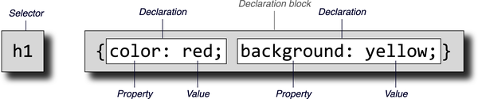

---
# Selectores de CSS
layout: two-cols
layoutClass: gap-4
---
# ¿Qué es un selector?
El selector CSS es la primera parte de una regla CSS. 
- Le indica al navegador qué elementos HTML deben seleccionarse para que se les apliquen los valores de las propiedades CSS dentro de la regla. 
::right::


---
# Type selector
layout: two-cols
layoutClass: gap-4
---
# Type selector
El `selector de tipo` afecta a los elementos HTML con el nombre del elemento. 
- Esta regla se aplica a todos los elementos del mismo tipo en el documento HTML
```css
/* File: style.css */
/* Black frame, centered text, 5 pixel distance from top */
header,
nav,
footer { 
  text-align:center;
  border: 1px solid black;
  margin-top: 5px;
}
/* Gray text */
h1,
abbr { color: gray; }
/* Gray dotted frame  */
p { border: 1px dotted gray; }
```
::right::
```html
<!DOCTYPE html>
<html>

<head>
    <title>type selector</title>
    <meta charset="UTF-8" />
    <link rel="stylesheet" href="css/style.css">
</head>
<body>
  <header>Header</header>
  <nav>Navigation</nav>
  <main>
    <h1>Type selectors</h1>
    <p>Such a type selector addresses the <abbr>HTML</abbr>
       elements directly via the element names. </p>
    <p> This rule is applied to all elements of the same type in the HTML document. It is irrelevant where in the HTML document these elements are written, to which class they belong or which identifier they have.</p>
  </main>
  <footer>Footer</footer>
</body>
</html>
```

[Probarlo](https://webdesignplayground.io/)
---
# Class selector
layout: two-cols
layoutClass: gap-4
---
# Class selector
El `selector de clase` es sensitivo a mayúsculas y minúsculas, comienza con punto `(.)`
- Se aplica a todo en el documento que tenga esa clase asignada.
```css {*}{maxHeight:'350px'}
/* Style for a note  */
  .note {
   margin-left: 50px;
   border-left: 10px solid green;
   padding-left: 5px;
 }
 /* Style for a warning  */
  .warning {
   border-left: 10px solid red;
   border-top: 2px solid red;
   border-right: 10px solid red;
   border-bottom: 2px solid red;
   text-align: center;
 }
 /* Font size to 140%; background color to gray  */
 .headfoot {
   font-size: 140%;
   background: #f5f5f5;
 }
 /* Font size to 130%   */
 .bigfont { font-size: 130%; }

 /* Inicia el código del ejemplo anterior */
 
/* Black frame, centered text, 5 pixel distance from top */
 #header,
 #nav,
 #footer { 
   text-align: center;
   border: 1px solid black;
   margin-top: 5px;
   padding: 5px;
   font-family: Verdana, Arial;
 }
 
 /* Font size to 140%; background color to gray  */
 #header,
 #footer {
   font-size: 140%;
   background: #f5f5f5;
 }
 
 /* 20 pixels distance from all other elements  */
 #main { margin: 20px; }
 

/* Gray text */
 h1,
 abbr {
   color: gray;
   font-family: Verdana, Arial;
 }
 
 /* Font family for all p elements, irrespective of the class.  */
 p { font-family: Verdana, Arial; }
 
 /* Style for a note */
  .note {
   margin-left: 50px;
   border-left: 10px solid green;
   padding-left: 5px;
 }
```
::right::
```html
<!DOCTYPE html>
<html>
<head>
    <title>Class selector</title>
    <meta charset="UTF-8" />
    <link rel="stylesheet" href="css/style.css" />
</head>
<body>
    <header class="headfoot">Header</header>
    <nav class="bigfont">Navigation</nav>
    <main>
      <h1>class selector</h1>
        <p>The p element without a class.</p>
        <p class="note">The p element with the class
           <code>note</code></p>
        <p class="note warning">The p element with the
           classes <code>note warning</code></p>
        <p class="warning">The p element with the class
           <code>warning</code></p>
        <p class="note bigfont">The p element with the
           classes <code>note bigfont</code></p>
    </main>
    <footer class="headfoot">Footer</footer>
  </body>
</html>
```

- Vaya al playground y pruebe ambos códigos

---
# ID selector
layout: two-cols
layoutClass: gap-4
---
# ID selector
- Se puede asignar un ID a un elemento HTML mediante el atributo `id`.
- Difiere del atributo class en que los ID son elementos únicos en un documento HTML.
- Usado en elementos div, para crear IDs únicos como content, header y navigation.

::right::

```html
<!DOCTYPE html>
<html lang="en">
<head>
    <title>Class selector</title>
    <meta charset="UTF-8" />
    <link rel="stylesheet" href="css/style2.css" />
</head>
<body>
    <div id="header">Header</div>
    <div id="nav">Navigation</div>
    <div id="main">
      <h1>class selector</h1>
        <p>The p element without a class.</p>
        <p class="note">The p element with the class
           <code>note</code></p>
        <p class="note warning">The p element with the
           classes <code>note warning</code></p>
        <p class="warning">The p element with the class
           <code>warning</code></p>
        <p class="note bigfont">The p element with the
           classes <code>note bigfont</code></p>
        </div>
    <div id="footer">Footer</div>
  </body>
</html>
```

---
# ID selector
hideInToc: true
---
# ID selector

```css {*}{maxHeight:'415px'}
/* Datei: style.css */
 
/* Black frame, centered text, 5 pixel distance from top */
 #header,
 #nav,
 #footer { 
   text-align: center;
   border: 1px solid black;
   margin-top: 5px;
   padding: 5px;
   font-family: Verdana, Arial;
 }
 
 /* Font size to 140%; background color to gray  */
 #header,
 #footer {
   font-size: 140%;
   background: #f5f5f5;
 }
 
 /* 20 pixels distance from all other elements  */
 #main { margin: 20px; }
 

/* Gray text */
 h1,
 abbr {
   color: gray;
   font-family: Verdana, Arial;
 }
 
 /* Font family for all p elements, irrespective of the class.  */
 p { font-family: Verdana, Arial; }
 
 /* Style for a note  */
  .note {
   margin-left: 50px;
   border-left: 10px solid green;
   padding-left: 5px;
 }
 
 
 /* Style for a warning  */
  .warning {
   border-left: 10px solid red;
   border-top: 2px solid red;
   border-right: 10px solid red;
   border-bottom: 2px solid red;
   text-align: center;
 }
 
 
 /* Font size to 140%; background color to gray */
 .headfoot {
   font-size: 140%;
   background: #f5f5f5;
 }
 
 /* Font size to 130%  */
 .bigfont { font-size: 130%; }
```

---
# Caracteres permitidos para los selectores
---
# Caracteres permitidos para los selectores
Consideraciones para el nombre del selector
- Usar letras mayúsculas y minúsculas (a-z; A-Z), dígitos (0-9), el guion (-) y el carácter de subrayado (_). 
- Además, el nombre no debe comenzar con un dígito.

---
# Pseudo-class
---

# Pseudo-class para hipervínculos visitados y no visitados
```css
/* css */
a:link { color: red; }
a:visited { color: green; }
...
```
```html
<h1>Enlace visitado</h1>
    <ul>
        <li><a href="http://www.washingtonpost.com/">Washington Post</a></li>
        <li><a href="http://www.nytimes.com/">New York Times</a></li>
        <li><a href="http://www.cnn.com/">CNN</a></li>  
    </ul>
```

---
# Pseudo-class
---

# Pseudo-class para interacciones con mouse y teclado
```css
/* css */
input { background-color: lightgray; }
input:focus { background-color: white; }
input:hover { box-shadow: 0 0 3px blue;  }
input:placeholder-shown { color: white; }
li { background-color: lightgray; }
li:hover { background-color: snow; }
li:active{ background-color: gray; }
a:link { text-decoration: none; color: blue; }
a:hover { font-weight: bold; }
a:active { color: red; }
...
```
```html
    <h1>:hover and :focus</h1>
    <ul>
      <li><a href="http://www.washingtonpost.com/>Washington Post</a></li>
      <li><a href="http://www.nytimes.com/>New York Times</a></li>
      <li><a href="http://www.cnn.com/>CNN</a></li>
    </ul>
    <h2>:focus</h2>
    <form>
    Your name:
      <input type="text name="name id="name placeholder="Your name />
    </form>
```
