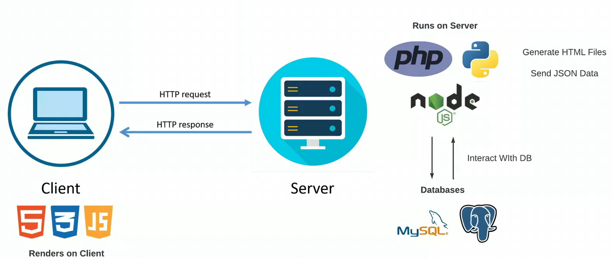
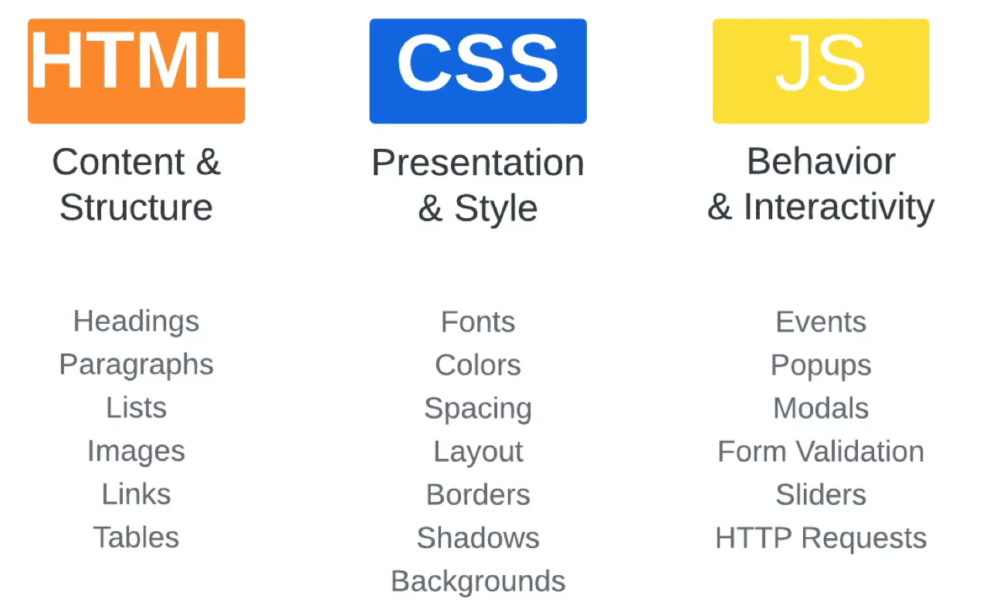
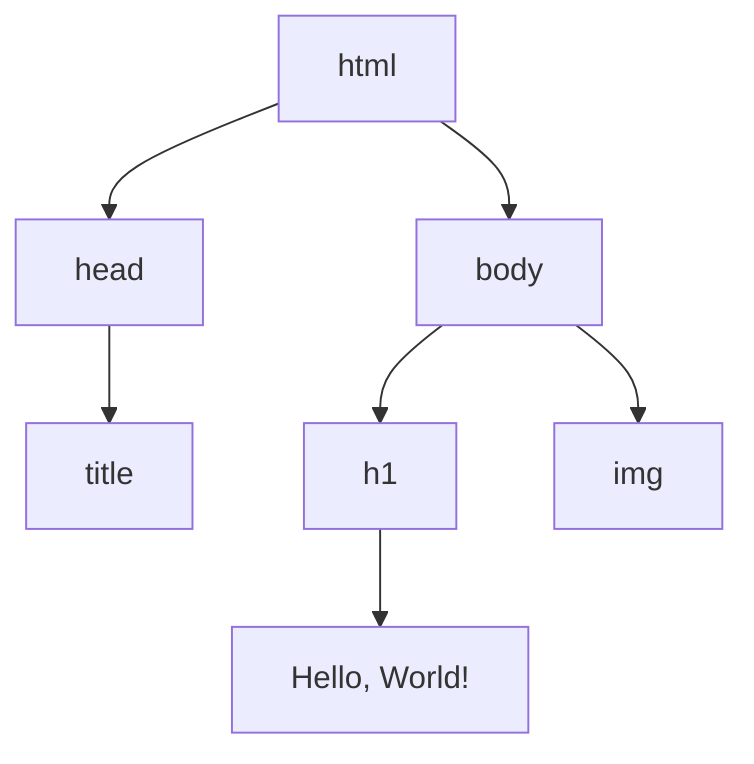
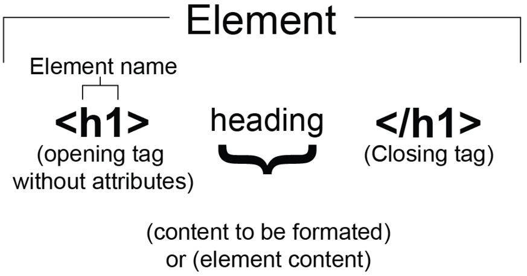
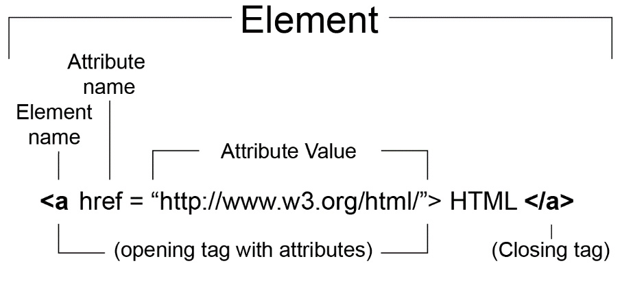

# Desarrollo web
El desarrollo web se refiere a la creación y mantenimiento de **sitios web**, **aplicaciones web** y otras plataformas en línea.
- Ejemplos de aplicaciones
    - Commercio electrónico
    - Entornos de aprendizaje
    - Telemedicina y expedientes médicos
    - Banca y finanzas
---
# Tecnologías usadas en el desarrollo web
---
# Tecnologías usadas en el desarrollo web
|                                   |                                            |
| ----------------------------------| ------------------------------------------ |
| HTML: Hypertext Markup Language   | Columna vertebral del desarrollo web    |
| CSS: Cascading Style Sheets       | Empleado para dar estilo y diseño a las páginas web |
| JavaScript                        | Creación aplicaciones interactivas. Ej. librerías y frameworks: React, Vue, Angular    |
| Server-side languages             | Posibilitan el contenido dinámico. Ej. PHP, Java, Python   |
| Web APIs                          | Permiten integrar servicios web. Ej. RESTful  |


---
# Tecnologías usadas en el desarrollo web
hideInToc: true
---
# Tecnologías usadas en el desarrollo web
|                                   |                                            |
| ----------------------------------| ------------------------------------------ |
| Cloud computing                   | Provee infraestructura escalable y flexible   |
| Progressive web apps              | Sitios web que se ven y comportan como apps nativas  |
| Artificial intelligence           | Usado para mejorar la experiencia usuaria. Ej. chatbots |

---
# Tecnologías cliente versus servidor
---
# Tecnologías cliente versus servidor


---
# Comparación html, CSS, Javascript
---
# Comparación entre html, CSS, Javascript


<style>
    img{
        margin: 10px auto;
        width:70%;
        height:70%;
    }
</style>

---
# HTML
---
# HTML
Lenguaje de marcado para crear páginas web.
- Se ejecuta en navegadores web: Google Chrome, Mozilla Firefox, Apple Safari, y Microsoft Edge
- No se ejecuta de igual forma en estos navegadores.
- El motor de renderizado del navegador toma el código HTML, CSS y JavaScript y lo convierte en una representación visual.
    - Toma el HTML y construye un modelo de objeto del documento (DOM). Probar código en: [WEB DESIGN PLAYGROUND](https://webdesignplayground.io/)

<div class="grid grid-cols-2 gap-5 pt-4 -mb-6">
```html
<html>
    <head>
        <title>Hello World with Image</title>
    </head>
    <body>
        <h1>Hello, World!</h1>
        

    </body>
</html>
```



</div>

---
# Características HTML
layout: two-cols
layoutClass: gap-16
hideInToc: true
---

# Características de HTML
* HTML es un lenguaje de marcado utilizado para describir la estructura de una página web.
* SINTAXIS
    - La sintaxis de HTML se compone de etiquetas (con corchetes angulares, <>) y atributos.


::right::
* Ejemplo de etiqueta con atributos



* Comentarios en HTML 
```html
<!-- Comment on a single line -->
<!--
  This comment is over multiple lines.
  Comments can be used to inform and for detailed
  documentation.
-->
```

* Leer más sobre [HTML](https://developer.mozilla.org/es/docs/Web/HTML)
<style>
    img{
        margin: 10px auto;
        width:70%;
        height:70%;
    }
</style>

---
# Estructura de HTML
layout: two-cols
---
# Estructura de HTML

 **<!doctype html>** es una declaración que le indica al navegador que está ante un documento HTML5.
- Se recomienda utilzar el atributo **lang**
- Metadata
    - **base**: Permite establecer una URL base.
    - **link**: Determina la relación entre una página y un recurso (como una hoja de estilo externa).
    - **meta**: Elemento comodín para metadatos.
    - **title**: Título de la página web tal como aparece en la pestaña del navegador y en los resultados de búsqueda.
::right::
```html
<!DOCTYPE html>
<html lang="es">
<head>
    <meta charset="UTF-8">
    <meta name="viewport" content="width=device-width, initial-scale=1.0">

    <title>Mi página de ejemplo</title>

    <base href="https://www.ejemplo.com/">

    <link rel="stylesheet" href="css/estilos.css">
    <link rel="icon" href="images/favicon.ico" type="image/x-icon">

    <meta name="description" content="Esta es una descripción de ejemplo de mi página web.">
    <meta name="keywords" content="ejemplo, metadatos, html">
    <meta name="author" content="Tu nombre">

</head>
<body>
    <h1>Bienvenido a mi página de ejemplo</h1>
    <p>Este es el contenido de tu página.</p>

    <a href="pagina2.html">Enlace a la página 2</a>

</body>
</html>
```
---
# Metadatos: el elemento <meta>
layout: two-cols
layoutClass: gap-16
---
# Metadatos: el elemento <meta>
```html
<meta
  name="description"
  content="The MDN Web Docs site provides information 
  about Open Web technologies including HTML, CSS, 
  and APIs for both Web sites and progressive web apps." />

```
::right::
1. Visite la página de inicio de [Mozilla Developer Network](https://developer.mozilla.org/en-US/)
2. Observe el código fuente CTRL+clic derecho - Ver código fuente
3. Encuentre el metadato descripción
4. Busque Mozilla Developer Network en un motor de búsqueda
